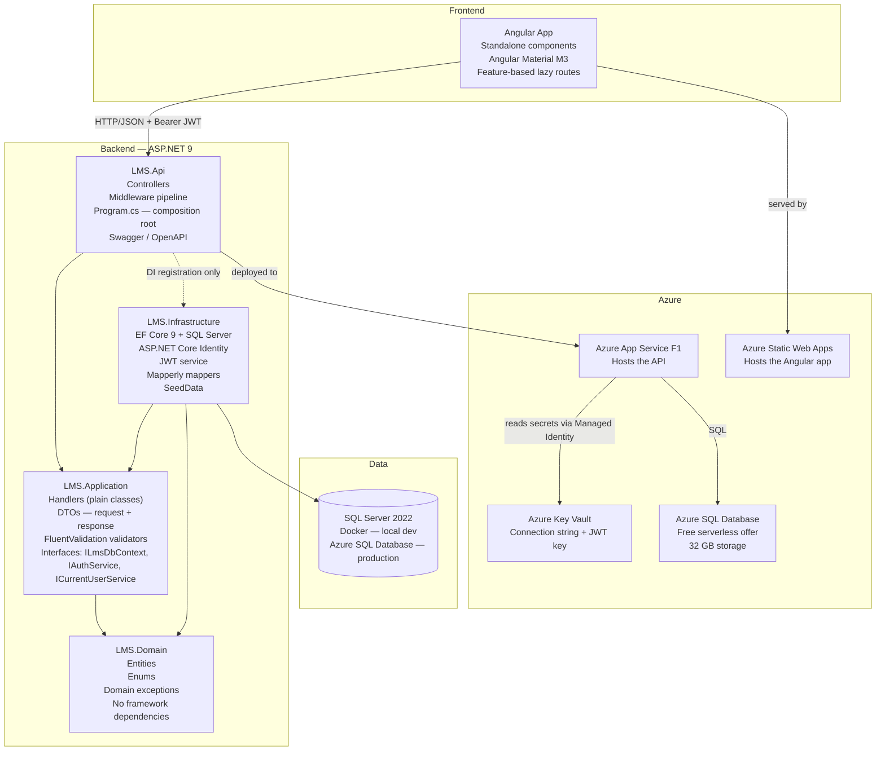
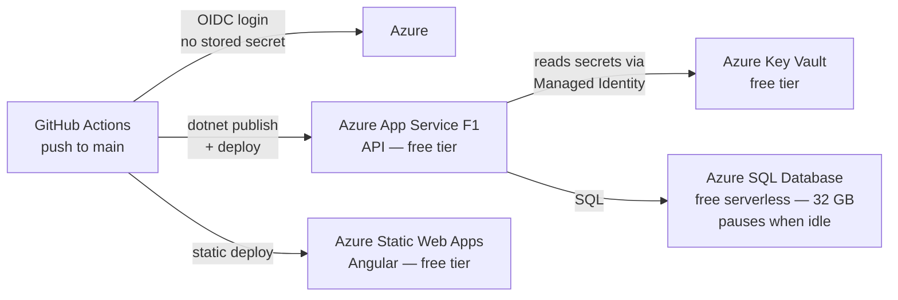

# Architecture — Enterprise LMS

## Overview

This project uses a **clean/layered architecture** with four backend projects and a separate
Angular frontend. The rule is simple: outer layers depend on inner layers, never the reverse.
This makes the business logic (Application + Domain) completely independent of frameworks,
databases, and HTTP — it can be tested in isolation.



## Project Responsibilities

### LMS.Domain

Pure C# — zero NuGet packages, zero framework references. Contains:
- **Entities** (POCOs): `User`, `Course`, `Module`, `Lesson`, `Enrollment`, `Progress`, `Quiz`, etc.
- **Enums**: `UserRole`, `CourseStatus`, `EnrollmentStatus`
- **Domain exceptions**: `NotFoundException`, `DomainException`

EF Core fluent configuration lives in Infrastructure, not here. No `[Column]` or `[Table]`
attributes on entities — keeping Domain framework-agnostic means it can be unit-tested without
spinning up any dependencies whatsoever.

### LMS.Application

Depends only on Domain. This is where the **business logic** lives. Contains:
- **Handler classes** — one per use case (`RegisterUserHandler`, `EnrollCourseHandler`, etc.).
  A handler receives a DTO, performs the work using injected interfaces, and returns a result.
  No MediatR — plain classes, plain constructor injection.
- **DTOs** — separate request and response shapes per feature. Domain entities are never
  exposed directly over HTTP.
- **FluentValidation validators** — live here because they encode business rules, not HTTP
  concerns. "Email must be unique" is a business rule; it belongs in Application, not the controller.
- **Interfaces** — `ILmsDbContext`, `IAuthService`, `ICurrentUserService`. Application
  calls through these; Infrastructure provides the implementations. This boundary is what
  makes Application testable without EF Core, SQL Server, or ASP.NET Core.

### LMS.Infrastructure

Depends on Application and Domain. Provides the concrete implementations:
- `LmsDbContext` implements `ILmsDbContext` — EF Core DbContext, SQL Server provider,
  global query filters for soft delete, `IEntityTypeConfiguration<T>` configs per entity
- `LocalAuthService` implements `IAuthService` — ASP.NET Core Identity + JWT generation
- `CurrentUserService` implements `ICurrentUserService` — reads `UserId` and `Role` from
  `HttpContext.User` claims
- `Migrations/` — EF Core schema history; run with `dotnet ef database update`
- `SeedData.cs` — seeds development data on startup when `ASPNETCORE_ENVIRONMENT=Development`
- Mapperly mapper classes — annotated with `[Mapper]`, source-generated at compile time,
  zero runtime reflection

### LMS.Api

The **composition root** — knows about all layers and wires them via DI in `Program.cs`. Contains:
- **Controllers**: thin HTTP layer. Accept input → call handler → return `ActionResult`.
  Zero business logic in controllers.
- **Program.cs**: service registration, middleware pipeline, CORS, Swagger, auth middleware
- `appsettings.json` + `appsettings.Development.json` (committed — dev-only Docker password)
- In production: config comes from Azure Key Vault via managed identity, not appsettings

## Dependency Flow

```
LMS.Api → LMS.Application → LMS.Domain
LMS.Api → LMS.Infrastructure → LMS.Application
                             → LMS.Domain
```

LMS.Api references Infrastructure **only to register services**. At runtime, Application calls
Infrastructure through interfaces — it never takes a compile-time dependency on it. This means
you can swap the database engine, auth provider, or any infrastructure concern without touching
Application or Domain.

## Key Seams

### Auth Provider Seam

`IAuthService` in Application is provider-agnostic:

```csharp
// LMS.Application/Interfaces/IAuthService.cs
public interface IAuthService
{
    Task<AuthResultDto> RegisterAsync(RegisterUserDto dto, CancellationToken ct);
    Task<AuthResultDto> LoginAsync(LoginDto dto, CancellationToken ct);
}
```

`LocalAuthService` in Infrastructure implements it using ASP.NET Core Identity today.

Adding Microsoft Entra ID means:
1. Implement `EntraIdAuthHandler` in Infrastructure — validates OIDC token, upserts user
2. Register it alongside `LocalAuthService` in `Program.cs`
3. Application layer is **untouched**

ASP.NET Core Identity already supports external logins natively (`AddExternalLogin`) —
the seam aligns with the framework's own design.

### Soft Delete Seam

All deletable entities have `bool IsDeleted`. EF Core entity configuration adds:

```csharp
builder.HasQueryFilter(e => !e.IsDeleted);
```

This makes EF Core automatically exclude soft-deleted records from every query. Admin
endpoints that need to see deleted records call `.IgnoreQueryFilters()` explicitly.

Right-to-erasure (GDPR) is handled by **anonymising PII fields** — nulling out `Email`,
`FirstName`, `LastName` — rather than physical deletion. Physical deletion would cascade-break
enrollment history and audit trails, which are legally required in many jurisdictions.

### Multi-tenancy Seam

Not implemented — but designed to slot in with zero handler changes:
1. Add `TenantId` (Guid) to all top-level entities
2. Resolve `TenantId` from a JWT claim in `CurrentUserService`
3. Add global query filter: `.HasQueryFilter(e => e.TenantId == _tenantId)`

All queries become automatically scoped. No handler needs to know about tenant isolation.
This is the standard pattern for enterprise multi-tenant SaaS platforms.

### Azure Config Seam

In development, config comes from `appsettings.Development.json`.
In production, config comes from Azure Key Vault via the
`Azure.Extensions.AspNetCore.Configuration.Secrets` NuGet package:

```csharp
// Program.cs — production path
if (!builder.Environment.IsDevelopment())
{
    var keyVaultUri = builder.Configuration["AZURE_KEY_VAULT_URI"];
    builder.Configuration.AddAzureKeyVault(
        new Uri(keyVaultUri),
        new DefaultAzureCredential());
}
```

`DefaultAzureCredential` uses the App Service's system-assigned **managed identity** —
no client secret is stored anywhere. The local development path is completely unchanged.

## Frontend Architecture

```
src/app/
├── core/                          # Singleton services — provided in root
│   ├── auth/
│   │   ├── auth.service.ts        # Login, register, token storage (localStorage)
│   │   ├── auth.guard.ts          # Functional guard: canActivate using inject()
│   │   └── jwt.interceptor.ts     # HTTP interceptor: attaches Bearer token to every request
│   ├── models/                    # TypeScript interfaces mirroring C# DTOs (kept in sync)
│   └── services/                  # Per-domain HTTP services (CoursesService, EnrollmentsService…)
├── shared/
│   └── components/                # Reusable dumb components (loading spinner, confirm dialog…)
└── features/                      # One folder per domain — lazy-loaded route chunks
    ├── auth/                      # Login + Register pages
    ├── courses/                   # Course catalog, course detail, lesson view
    ├── users/                     # Admin user management (MatTable + sort/filter)
    ├── enrollments/               # Approval workflow (Manager view)
    ├── progress/                  # Progress tracking UI
    ├── quizzes/                   # Quiz component
    └── learning-paths/            # Stretch — Learning Path list and detail
```

Lazy loading via `loadComponent()` / `loadChildren()` in `app.routes.ts`. Each feature
route is a separate bundle — users only download the code for pages they actually visit.

## Angular Patterns Reference

| Pattern | Where used | Why |
|---------|-----------|-----|
| Standalone components | Everywhere | Modern Angular — no NgModule boilerplate |
| `inject()` | Guards, interceptors, services | Works in functional context; no constructor needed |
| `@if / @for / @switch` | All templates | Built-in control flow (Angular 17+); replaces `*ngIf / *ngFor` |
| `signal()` + `computed()` | Component-local state | Synchronous reactivity; no async pipe for simple values |
| `toSignal()` | Service → component boundary | Converts Observable to signal cleanly |
| Reactive Forms | Login, Register, Course edit, Quiz | Typed; validators; programmatic control |
| MatTable + MatSort + MatPaginator | User list, course list | Material data table with built-in sort and pagination |
| Lazy-loaded routes | All features | Code splitting; faster initial load |
| `HttpTestingController` | Service unit tests | Intercepts HTTP calls; verifies URL, method, headers |

## Azure Deployment Architecture



| Service | Free tier details |
|---------|------------------|
| Azure App Service | F1 plan — free; 60 CPU-min/day |
| Azure Static Web Apps | Free tier — suitable for portfolio traffic |
| Azure SQL Database | Free serverless offer — 32 GB; pauses when idle (zero cost at rest) |
| Azure Key Vault | Free tier — 10,000 operations/month |
| GitHub Actions | Free for public repositories |

OIDC eliminates stored Azure credentials. GitHub Actions authenticates to Azure using a
short-lived federated token scoped to the specific repository — the same pattern enterprise
teams use.
