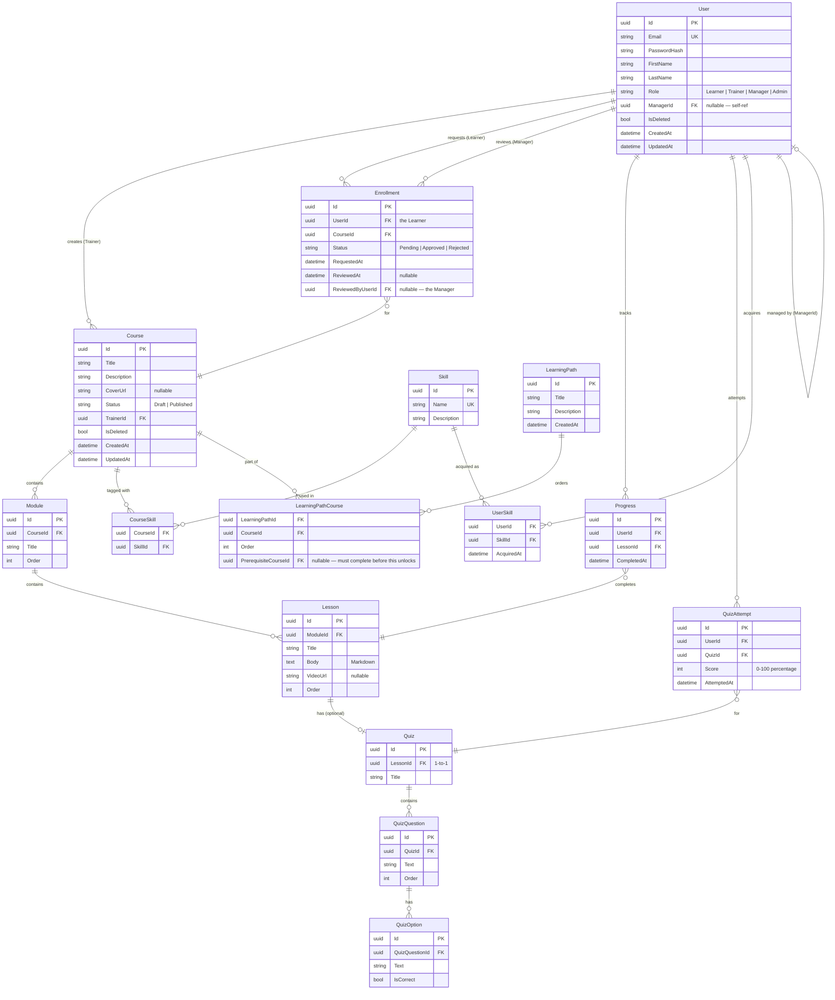

# Database Schema — ER Diagram

## Key Design Decisions

**UUID primary keys** — no auto-increment integers. Avoids enumeration attacks, works naturally with distributed systems, and simplifies multi-tenant isolation if added later.

**Soft delete on User and Course** — `IsDeleted` flag; EF Core global query filter hides them automatically from all queries. Right-to-erasure (GDPR) is handled by anonymising PII fields (null out Email, FirstName, LastName) rather than physical deletion, which would break enrollment history and audit trails.

**Progress is per-lesson, not per-course** — course progress % is derived on read: `completedLessons / totalLessons`. We don't save a single percentage number for the whole course. Instead, we save a completion record for every lesson a user finishes. When the dashboard loads, the app counts those records to calculate progress. This ensures the percentage is always accurate, even if a trainer adds or removes lessons after some learners have already started.

**Enrollment is per-course** — when a learner joins a Learning Path, the system creates individual enrollments for each course in the path. The course is still the access-control primitive: if you are not enrolled in a specific course, you cannot see its lessons, regardless of path membership. Benefits of this design:

- **Security**: the access check is a single query — "is the user enrolled in this course?"
- **Flexibility**: a course can be assigned standalone without belonging to a path
- **Independence**: deleting a Learning Path does not remove a learner's course progress
- **Simpler code**: no multi-level checks (Path → Course → Lesson); the logic stays flat
- **Clearer reporting**: managers can see exactly which courses each team member has completed

**QuizAttempt stores score as 0–100** — percentage is cleaner to display than raw counts. Multiple attempts are allowed; each attempt has its own record so history is preserved.

**Module is organisational only** — a Module is a label that groups lessons into sections (e.g., "Part 1: Foundations"). It has no business rules of its own. Learners do not enroll in modules and progress is not tracked at the module level. The system only tracks individual lessons, which keeps the data model flat and the queries simple.
